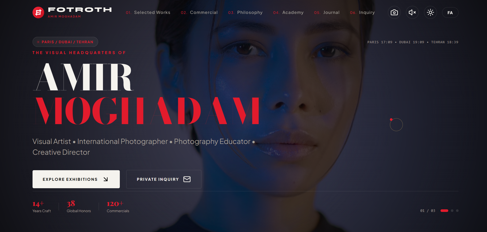

# FOTROTH — V1.0 · Concept 02

*A visual house for photography, art & creative direction.*

FOTROTH is a premium digital platform concept created for **Amir Moghadam**, photographer, visual artist, creative director, and educator.

Concept 02 establishes the visual foundation for the future FOTROTH platform: a cinematic, editorial, photography-first experience combining the atmosphere of a luxury creative studio with the character of a contemporary art archive.

> **This repository contains V1.0 — the approved Concept 02 visual foundation.**

## Designer & Developer

**Fatemeh Khalesi Nezhad**

*Designer · Developer · Creative Technologist*

FOTROTH combines interests in:

* UI/UX
* Visual design
* Frontend development
* Branding
* Creative technology
* AI-assisted development
\
**FOTROTH**
*A visual house for photography, art & creative direction.*

© 2026 FOTROTH